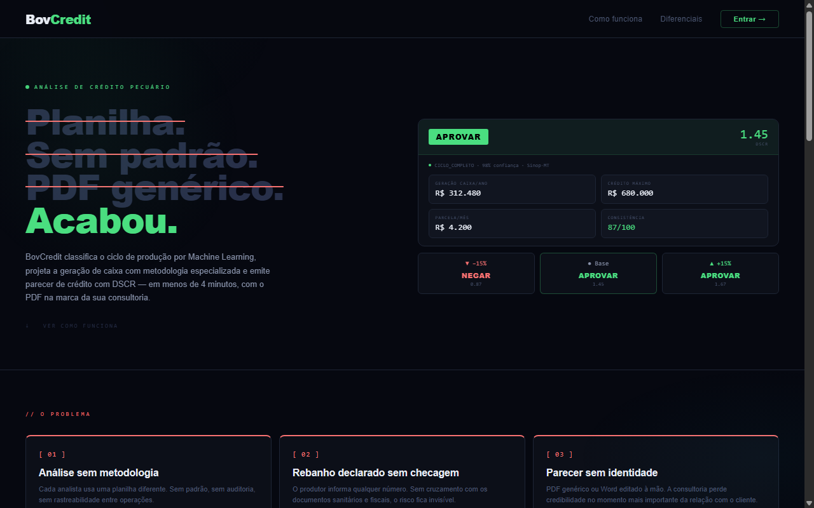
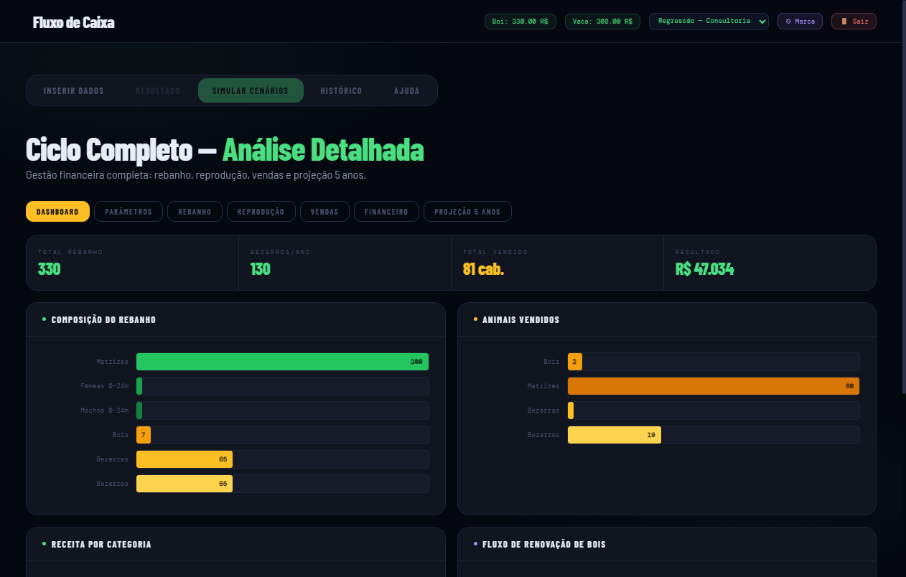

# BovCredit — Plataforma de Análise de Crédito Pecuário

> **Emita pareceres de crédito rural com metodologia, Machine Learning e PDF com a marca da sua consultoria — em minutos.**

Sistema de apoio à análise técnico-financeira de rebanho bovino para **consultorias de crédito rural e analistas de banco**. Classifica automaticamente a modalidade de exploração, importa fichas XLSM e documentos sanitários, projeta a geração de caixa, audita a consistência do rebanho e emite um parecer com níveis operacionais de recomendação — sempre com memória de cálculo e indicação da qualidade dos dados.

Este documento descreve o sistema **como ele está**. O BovCredit é uma pré-análise de apoio à consultoria: não substitui conferência documental, visita à propriedade ou a decisão final do agente de crédito.

---

## Screenshots

**Landing page**


**Inserir dados do rebanho**


**Simular Cenários — Dashboard**


---

## Por que usar

| Problema da consultoria hoje | O que a plataforma resolve |
|---|---|
| Análise em planilha, demorada e propensa a erro | Resultado completo em menos de 1 minuto |
| Sem metodologia padronizada entre analistas | Metodologia uniforme, com memória de cálculo |
| Rebanho declarado sem auditoria | Score de consistência, flags e reconciliação entre documentos |
| Garantia avaliada pela cotação cheia | Deságio por categoria e LTV sobre o valor de execução |
| Endividamento informado sem origem | Inventário por credor, confrontável com o SCR |
| Preço nacional aplicado no Brasil inteiro | Diferencial por praça atravessando toda a cadeia |
| PDF genérico | PDF com logo e nome da consultoria |
| Sem histórico | Histórico por fazenda com pareceres para download |

---

## 1. Números

| | |
|---|---|
| Python (produção) | 10.476 linhas |
| Interface (`templates/index.html`) | 3.750 linhas |
| Testes | **867** casos coletados |
| Rotas HTTP | 44, sendo 25 endpoints `/api` |
| Modelo | ensemble de 4, 42 features, 6 classes |
| Agências estaduais lidas | 7 |
| Tabelas no banco | 12 |

---

## 2. O fluxo de uma análise

1. **Entrada** — 10 contagens por faixa etária e sexo, digitadas, importadas de Excel ou extraídas de um PDF de declaração estadual.
2. **Classificação** — o ensemble aponta a modalidade entre seis, com probabilidade, proveniência da decisão (regra ou ML) e índice de atipicidade.
3. **Praça** — informado o município, o preço nacional recebe o diferencial regional. Tudo abaixo herda esse preço.
4. **Simulação** — projeção plurianual por coortes etárias, no cenário conservador, com venda, compra, mortalidade e evolução de idade.
5. **Fluxo de caixa** — metodologia GEP Araguaia, incluindo variação de estoque do rebanho.
6. **Auditoria** — consistência do rebanho, reconciliação de garantia entre documentos, desfrute contra a faixa da modalidade.
7. **Crédito** — DSCR em **todos** os anos do prazo, endividamento total, garantia pelo valor de execução.
8. **Parecer** — recomendação, memória de cálculo, explicação SHAP, PDF com a marca da consultoria.
9. **Confirmação** — o analista confirma ou corrige a modalidade, e isso vira dado de treino.
10. **Qualidade dos dados** — separa dados observados, informados, estimados e ausentes.
11. **Documentação** — checklist de GTA/inventário, CAR, propriedade, custos, pesagens e endividamento.
12. **Importação XLSM** — ficha de classificação de rebanho com múltiplas fazendas e macros preservadas.
13. **Fluxo mensal** — demonstração estimada de receita, custos, dívida, fluxo livre e mês crítico.

---

## 3. Motor de classificação — `ml_engine.py`

**Ensemble de quatro modelos votando** (`VotingClassifier`, soft voting): RandomForest, GradientBoosting, XGBoost e LightGBM.

**Entrada:** 10 contagens → **42 features** engenheiradas.

```
v = [fêmeas 00–04m, machos 00–04m,
     fêmeas 05–12m, machos 05–12m,
     fêmeas 13–24m, machos 13–24m,
     fêmeas 25–36m, machos 25–36m,
     fêmeas adultas, machos adultos]
```

**Saída:** uma de **seis** modalidades.

| Modalidade | Perfil |
|---|---|
| `CRIA` | matrizes dominam; receita é bezerro |
| `RECRIA` | poucos adultos, predomínio de jovens; ganho de peso intermediário |
| `ENGORDA` | confinamento; 85% em 13–24m, saída para abate |
| `CICLO_COMPLETO` | cria, recria e engorda integrados |
| `RECRIA_ENGORDA` | compra magro e termina; giro alto |
| `CRIA_RECRIA` | produção própria mais compra de desmama |

**Acurácia: 91,2% ± 5,41** em validação cruzada, 34.902 amostras.

> **Ressalva que importa:** esse conjunto é **sintético**, gerado das faixas de referência que nós mesmos escrevemos em `treinar_ciclos.py`. O número mede que o modelo aprendeu as faixas, não que acerta na realidade. É validação circular — e é exatamente por isso que existe o botão de confirmação (§9).

**Também no motor:**
- **SHAP** (TreeExplainer) — explicabilidade técnica para governança e revisão humana; não certifica conformidade regulatória
- **Proveniência** da decisão: regra determinística ou ML
- **Atipicidade**: o quanto o rebanho se afasta da distribuição de treino
- **Agrupamento de features redundantes** no SHAP (7 pares com correlação 1,0)

---

## 4. Leitura de documentos — `pdf_parsers.py`

1.375 linhas. **Sete agências estaduais de defesa agropecuária:**

| Agência | UF | Faixas etárias |
|---|---|---|
| INDEA | MT | 5 (0-4 / 5-12 / 13-24 / 25-36 / 36m+) |
| AGRODEFESA | GO | 5 |
| IDARON | RO | 4 (0-12 / 13-24 / 25-36 / 36m+) |
| IAGRO | MS | 4 |
| AGED | MA | 4 |
| ADAPEC | TO | 4 |
| ADEPARÁ | PA | 4 |

Extração em cascata: `pdftotext` → `pdfplumber` → OCR (Tesseract) para PDF escaneado. Mais um parser genérico de fallback. Múltiplos PDFs de uma vez — o sistema soma os rebanhos.

**É o fosso do projeto.** Formatos diferentes por estado, órgãos que mudam layout sem avisar, PDF e papel. Não se compra de fornecedor e não se resolve com modelo — é integração acumulada.

Também lê planilhas Excel (template em `/api/template/download`) e texto colado.

---

## 5. Simulação por coortes

Quatro motores, não seis — `CRIA_RECRIA` usa o de cria, `RECRIA_ENGORDA` usa o de engorda.

Cada um rastreia coortes etárias e fecha o balanço:

```
fim = início + nascimentos + compras − vendas − mortes
```

Quatro cenários: `conservador`, `crescimento`, `otimista`, `especulativo`. **O parecer usa o conservador.**

---

## 6. Análise financeira

### Fluxo de caixa — metodologia GEP Araguaia

```
(+) Receita de vendas
(−) Custo operacional (desembolso)
(−) Reposição de reprodutores
(=) RESULTADO OPERACIONAL ← base do DSCR

(±) Variação de estoque do rebanho
(=) RESULTADO ECONÔMICO TOTAL ← riqueza criada (caixa + patrimônio)

(−) Serviço da dívida anual
(=) FLUXO LIVRE
```

A **variação de estoque** — o valor criado pelo crescimento do plantel — é o diferencial: nenhum sistema de crédito rural concorrente a calcula automaticamente.

### DSCR em todos os anos do prazo

O DSCR do ano 1 sozinho engana: o primeiro ano liquida o estoque de animais prontos declarado na ficha; os seguintes vendem só a produção corrente. Um ciclo completo chegou a projetar **6,08 no ano 1 e −0,53 no ano 2** — e o parecer aprovava um crédito de 36 meses.

Hoje a recomendação segue o **ano crítico**.

### Política de crédito

Ajustável — não é benchmark zootécnico.

| Parâmetro | Valor |
|---|---|
| DSCR para aprovar | ≥ 1,30 |
| DSCR para ressalva | ≥ 1,00 |
| LTV folgado | ≤ 60% |
| LTV ajustado | ≤ 80% |
| Comprometimento de renda | ≤ 70% |

**Crédito máximo** por inversão do DSCR alvo. **Sensibilidade** a preço (−15% / base / +15%) e a custo. **Breakeven** e **COE** contra referência Campo Futuro/CNA.

**Custos por modalidade** — cria R$ 90,88/cab·mês contra ciclo completo R$ 119,14.

### Endividamento total — `services/endividamento.py`

Inventário por credor: instituição, saldo devedor, parcela. O campo único antigo continua funcionando e passa a se declarar **não discriminado**. O comprometimento soma a parcela do crédito em análise, porque a decisão é sobre a situação *depois* da operação.

Ausência declarada dispara aviso para conferir o **SCR do Banco Central** — zero declarado pode ser verdade ou omissão, e o parecer não trata os dois igual.

### Garantia pelo valor de execução — `services/garantia.py`

Rebanho em penhor não se realiza pela cotação do dia: entre a inadimplência e o caixa há apreensão, transporte, risco sanitário e venda forçada.

| Categoria | Deságio | Por quê |
|---|---|---|
| Boi (25m+) | 25% | cotação pública, vende na semana |
| Garrote (13–24m) | 35% | falta terminação |
| Matriz | 35% | valor depende da vida reprodutiva restante |
| Novilha (13–24m) | 40% | ainda não pariu |
| Bezerro/a (0–12m) | 50% | dois anos até terminação, maior mortalidade |

O deságio médio acompanha a composição do rebanho. O LTV é medido sobre o valor de execução, não sobre o de mercado.

### Rebaixamento

Capacidade de pagamento, garantia, endividamento e consistência são perguntas **independentes** — vale a **pior** das respostas. Cada motivo entra na memória de cálculo mesmo quando a recomendação já caiu por outro: o comitê precisa ver todos os problemas, não só o primeiro que disparou.

### Níveis operacionais de recomendação

O resultado matemático da capacidade de pagamento é separado da condição documental da operação:

| Nível | Significado |
|---|---|
| `PRÉ-APROVADO` | Capacidade adequada e documentação mínima recebida |
| `APROVAÇÃO CONDICIONADA À DOCUMENTAÇÃO` | Resultado favorável, mas há documentos obrigatórios pendentes |
| `REVISÃO COM RESSALVAS` | Existem alertas de risco, consistência, garantia ou endividamento |
| `NÃO RECOMENDADO` | O cenário não sustenta a operação nas premissas informadas |
| `SEM CRÉDITO INFORMADO` | Análise zootécnica/preliminar sem solicitação de financiamento |

### Qualidade e origem dos dados

Cada análise informa se o dado veio da ficha, foi informado pelo analista ou foi estimado por benchmark. Uma ficha sanitária contém contagens por sexo e idade, mas não comprova sozinha peso, GMD, natalidade, custos ou capacidade de pagamento. Estimativas são identificadas e reduzem a confiança da análise.

### Importação da ficha XLSM

O arquivo `static/classificacao_rebanho_fichas.xlsm` é disponibilizado pelo endpoint `/api/ficha/download` e pelo botão **Baixar Ficha XLSM**. O manual está em `/api/ficha/instrucoes`. A ficha preserva o projeto VBA original; macros devem ser habilitadas no Excel Desktop. O importador lê a aba `CONSOLIDADO`, reconhece múltiplas fazendas, valida totais e mapeia as categorias para as 10 posições do motor. A categoria 0–12 meses é dividida 50/50 entre as duas faixas jovens quando não existe idade mais detalhada.

### Pesos e rendimentos por categoria

| Categoria | Arrobas-eq | Referência de preço |
|---|---|---|
| Boi adulto | 20,53@ | `preco_boi` |
| Vaca/Matriz | 15,33@ | `preco_vaca` |
| Garrote 13–24m | 10,67@ | `preco_boi` |
| Novilha 13–24m | 9,33@ | `preco_vaca` |
| Bezerro 0–12m | 6,67@ | `preco_bezerro` (R$/cab) |
| Bezerra 0–12m | 6,00@ | `preco_bezerra` (R$/cab) |

### Parâmetros zootécnicos default

| Parâmetro | Valor |
|---|---|
| Natalidade | 70% |
| Desmame | 82% |
| Mortalidade geral | 3% (adulto 2%, bezerra 7%) |
| Ganho | 0,7@/mês |
| Proporção matrizes | 35% |

Desfrute de referência por modalidade: CRIA 24% · CICLO_COMPLETO 30% · CRIA_RECRIA 32,5% · RECRIA 45% · RECRIA_ENGORDA 72,5% · ENGORDA 100%.

---

## 7. Auditoria — onde os concorrentes não vão

### Reconciliação de garantia — `services/reconciliacao.py`

Cruza rebanho declarado em documentos distintos para detectar superavaliação:

| Documento | Representa |
|---|---|
| Ficha sanitária (órgão estadual) | Piso físico — animais vacinados, não pode ser forjado |
| Imposto de Renda | Declaração à Receita Federal |
| GTA | Movimentações recentes |

O caso real coberto por teste: **45.361 declarados contra 9.433 na ficha**.

### Consistência do rebanho — `services/consistencia_rebanho.py`

Score 0–100 com flags automáticos:

| Flag | Tipo | Critério |
|---|---|---|
| Pirâmide invertida | Erro | Bezerros > adultos × fator esperado |
| Touro impossível | Erro | Sem bois com muitas matrizes |
| Matrizes sem bezerros | Alerta | Matrizes adultas mas zero bezerros |
| Relação F/M anômala | Alerta | Proporção fora de padrão por ciclo |
| Crescimento implausível | Erro | Rebanho cresceu > 200% em 12 meses |
| Categoria desaparecida | Alerta | Categoria com > 50 cabeças sumiu no histórico |

Há erro e a recomendação seria Aprovar? O sistema rebaixa para Ressalva com justificativa.

### Desfrute contra a própria referência

Teto por modalidade — acima disso, alerta:

| Ciclo | Teto |
|---|---|
| CRIA | 30% |
| CICLO_COMPLETO | 40% |
| CRIA_RECRIA | 40% |
| RECRIA | 55% |
| RECRIA_ENGORDA | 85% |
| ENGORDA | 120% |

**Essa guarda já pegou um bug do nosso próprio simulador** (§15).

### Memória de cálculo

Passo, valor e explicação em todo resultado. É o que torna o parecer defensável diante do comitê e do BACEN, onde um score opaco não é.

### Trilha de auditoria de acesso — `services/auditoria.py`

Quem viu o quê, quando, de onde. Sem isso a instituição não responde à própria auditoria interna sobre quem consultou dado de crédito de qual cliente — e essa pergunta aparece na área de compras antes de qualquer discussão sobre modelo.

Registrados: login, login recusado, logout, parecer gerado, PDF baixado, histórico e pareceres consultados, ciclo confirmado, documento lido, ação administrativa, vínculo e consulta por WhatsApp.

Três regras de desenho:

1. **Append-only.** Não há rota de escrita nem de exclusão — trilha que se edita não é trilha.
2. **Nunca derruba a operação.** Falha ao registrar vira log de erro no servidor. Um parecer que falha porque a auditoria caiu acaba com a auditoria desligada na primeira sexta-feira ruim.
3. **Registra a referência, não o conteúdo.** Copiar o rebanho para uma segunda tabela só multiplicaria a superfície de vazamento do que se quer proteger.

Consulta em `GET /api/admin/auditoria`, restrita a administrador — a trilha diz quem acessou dado de quem, então ela própria é dado sensível.

### Ingestão do IBGE — `services/ibge_sidra.py`

O caminho para tirar o `0 medidos` do zero:

```
desfrute(UF) = cabeças abatidas (tab. 1092) ÷ efetivo do rebanho (tab. 3939)
```

```bash
python ingerir_ibge.py --so-mostrar    # busca e imprime
python ingerir_ibge.py                 # grava dados/desfrute_uf.json
```

**Ressalva que vai junto com o número:** abate ÷ efetivo **não é** desfrute exato — ignora venda viva entre propriedades e inclui animal abatido em UF diferente da de origem (MT exporta boi em pé; SP abate mais do que cria). É o proxy padrão do setor e é citável, mas o parecer precisa dizer o que ele é.

> **Nunca foi exercitado contra a API real.** O ambiente de desenvolvimento bloqueia saída para o IBGE (403 no proxy), então o parsing foi escrito a partir da documentação e testado com fixtures. O parser detecta o cabeçalho em vez de assumir `values[0]`, trata os marcadores do IBGE (`-`, `..`, `...`, `X`) como ausência e não como zero, e **levanta com o payload recebido** quando a forma não bate — para a primeira execução com rede falhar alto em vez de gravar lixo.

### Segundo fator (TOTP) — `services/totp.py`

RFC 6238, implementado sobre a biblioteca padrão. São ~60 linhas de HMAC; trazer um pacote adicionaria superfície de supply chain **no caminho de autenticação**, que é o último lugar onde se quer dependência de terceiro.

Validado contra os **seis vetores oficiais do Apêndice B da RFC 6238** — se falhassem, nenhum aplicativo autenticador do mundo geraria o código que o servidor espera.

O que costuma sair errado numa implementação caseira, e está resolvido:

| Armadilha | Como |
|---|---|
| Reuso do código dentro da janela de 90s | Contador aceito é persistido; o mesmo código não vale de novo |
| Comparação não constante (vaza prefixo pelo tempo) | `hmac.compare_digest` |
| Janela larga "para o relógio do celular" | ±1 passo (±30s) — janela larga multiplica a chance de força bruta |
| Ativar antes de confirmar | O segredo fica gravado **inativo** até um código provar que o app funciona |
| Sessão criada antes do segundo fator | O id vai para `totp_pendente`, não para `_user_id` |
| Etapa pendente eterna | Expira em 5 minutos |
| Perder o celular = perder a conta | 10 códigos de recuperação, de uso único, guardados em hash |
| Sessão sequestrada desliga o 2FA | Desativar exige a senha |

Rotas: `POST /api/2fa/iniciar` · `POST /api/2fa/confirmar` · `POST /api/2fa/desativar` · `GET /api/2fa/estado`.

### LGPD como código — `services/lgpd.py`

Cobre as obrigações que se **implementam**. Não cobre as que se **escrevem** — base legal, encarregado (DPO), política de privacidade, contrato de operador são decisão da empresa.

**A tensão que o desenho resolve.** A trilha de auditoria é append-only por decisão explícita: uma trilha que se edita não é trilha. Mas o Art. 18 dá ao titular direito à eliminação, e a trilha guarda e-mail e IP.

Os dois não se atendem apagando linhas. A resolução é **anonimizar, não excluir**: o evento permanece (quem auditou continua sabendo que às 14h32 alguém consultou o parecer 412), a pessoa deixa de ser identificável.

O pseudônimo é **estável** de propósito — trocar por `NULL` destruiria a capacidade de reconstruir uma sessão, e *"o mesmo usuário fez 40 consultas em 3 minutos"* é exatamente o que uma investigação de vazamento precisa ver.

| Rota (admin) | O quê |
|---|---|
| `GET /api/admin/lgpd/inventario` | Registro das operações de tratamento (Art. 37) |
| `GET /api/admin/lgpd/exportar/<id>` | Portabilidade (Art. 18, V) |
| `POST /api/admin/lgpd/anonimizar/<id>` | Direito de eliminação (Art. 18) |
| `POST /api/admin/lgpd/purgar-auditoria` | Retenção — default 730 dias |

**Pareceres não são apagados.** São dado do *cliente da consultoria*, com valor probatório e prazo próprio de guarda. Anonimizar um analista não destrói o documento que ele emitiu.

A purga por retenção é a única exceção ao append-only, e é limitada por desenho: apaga em bloco por corte de tempo, não aceita filtro por usuário ou evento — um teste inspeciona a assinatura da função para garantir isso — e ela própria fica registrada na trilha.

### Origem dos parâmetros — `services/proveniencia.py`

Um deságio de 35% é **política** (a instituição escolheu, e pode mudar). Um desfrute de 21,7% seria **medição** (o IBGE apurou, e se cita). Uma natalidade de 70% é **referência** (bibliografia, não apurada nesta fazenda). Um custo digitado é **declaração** (informada, não verificada).

Antes todos apareciam iguais na tela — eram só números. Agora cada parâmetro carrega origem, fonte, ano e UF, e o parecer traz a tabela completa:

> 26 parâmetros sustentam este parecer: **0 medidos**, 13 de referência, 13 de política e 0 declarados.

`Parametro` herda de `float`, então o motor de simulação inteiro segue fazendo aritmética sem saber que o número tem etiqueta. Trocar referência por medição é trocar o registro — nenhuma fórmula muda.

**O zero em "medidos" é honesto e é a régua:** hoje o projeto não tem nenhuma série apurada por terceiro. Um teste guarda isso e falha no dia em que alguém marcar algo como medido sem fonte real.

---

## 8. Preço por praça — `services/precos_regionais.py`

O indicador CEPEA/ESALQ é praça de São Paulo. O sistema aplicava o mesmo preço no Brasil inteiro.

Informado o município, o diferencial da UF é aplicado **uma vez**, no ponto onde os preços são resolvidos, e propaga para valoração, receita, fluxo, breakeven, sensibilidade e garantia.

Mesmo rebanho, mesmo crédito de R$ 1,5 milhão:

| Praça | Basis | Garantia | LTV | Veredito |
|---|---|---|---|---|
| SP | 0% | 2.070.802 | 72,4% | ajustada |
| GO | −4% | 1.987.970 | 75,5% | ajustada |
| MT | −7% | 1.925.846 | 77,9% | ajustada |
| RO | −10% | 1.863.722 | 80,5% | **insuficiente** |

> **Origem dos diferenciais:** calibração de referência, **não medição nossa**. O parecer, a tela e o PDF declaram isso por escrito. Limitação conhecida: o mercado de reposição é mais segmentado regionalmente que o de boi gordo, então o diferencial verdadeiro do bezerro costuma ser maior — aplicamos o mesmo fator por ora.

**Cotações automáticas:** scraper diário às 8h — CEPEA/ESALQ (boi, bezerro) e Scot (vaca) — com faixas de sanidade que rejeitam valor absurdo e fallback para a última cotação salva.

---

## 9. O loop de dado real

Todo o treino é sintético. O **botão de confirmação de ciclo** é o único caminho por onde entra rótulo humano: o analista confirma a modalidade classificada ou aponta a correta entre as seis.

O invariante, coberto por teste: o retreino consome **exclusivamente** `class_conf`. Registro não confirmado não entra — o modelo nunca aprende com a própria previsão.

A correção vale mais que a confirmação: é ela que mostra onde a faixa de referência está errada.

---

## 10. IA e canais

**Narrativa e chat** — Groq / Llama 3.3 70B. Gera a leitura em prosa do parecer e responde perguntas sobre ele. Assíncrono por padrão, para não somar 20s de latência à análise.

**WhatsApp** — o mesmo chat, no canal onde o analista já está.

A regra que impede vazamento: o webhook recebe um telefone e nada mais. Sem vínculo explícito, responder sobre um parecer entregaria dado de crédito a quem descobrisse o número do bot. O vínculo exige um código de uso único, 15 minutos de validade, gerado por um analista **logado**. Número desconhecido não faz o modelo ser nem consultado.

Autenticidade por HMAC-SHA256 em cada POST. Sem `WHATSAPP_APP_SECRET` a requisição é **recusada**, não aceita — segredo ausente não vira "aceita tudo".

Detalhes cobertos que quebrariam em produção: o **nono dígito** (a Meta entrega celular brasileiro sem ele, o usuário digita com), recibos de leitura que gerariam laço, e o 200 obrigatório em falha para a Meta não reenviar.

---

## 11. Multiempresa e multiusuário

```
Consultoria A
├── Analista 1 (admin)
├── Analista 2
└── Fazendas: [Fazenda Norte, Fazenda Sul]

Consultoria B
├── Analista 3
└── Fazendas: [Fazenda Leste]
```

- Isolamento total entre consultorias
- Um usuário pode ser membro de múltiplas empresas
- Painel `/admin` para gestão de empresas, membros e permissões
- Logo e nome da consultoria configuráveis por empresa (aparecem no PDF)

---

## 12. Tecnologia e arquitetura

| Camada | Tecnologia |
|---|---|
| Backend | Python 3.11.15 + Flask |
| ML | scikit-learn, XGBoost, LightGBM, SHAP |
| Banco | PostgreSQL (produção) / SQLite (desenvolvimento) |
| PDF geração | reportlab |
| PDF leitura | pdfplumber + Tesseract (OCR) |
| IA | Groq (Llama 3.3 70B) |
| Frontend | HTML/CSS/JS (sem framework) |
| Scheduler | APScheduler |
| Deploy | Docker no Railway (auto-deploy via push em `main`) |

### Estrutura

```
app.py                        # Flask — rotas, auth, scheduler
ml_engine.py                  # Ensemble ML + simulações por coortes
database.py                   # Abstração SQLite/PostgreSQL
scraper.py                    # Cotações diárias
pdf_parsers.py                # 7 agências estaduais + genérico
treinar_ciclos.py             # Geração do conjunto de treino

services/
  fluxo_caixa_gep.py          # Valoração + DRE
  parecer_credito.py          # Price, DSCR, ano crítico, rebaixamento
  parecer_pdf.py              # Geração do PDF
  garantia.py                 # Deságio por categoria e LTV
  endividamento.py            # Inventário por credor
  precos_regionais.py         # Diferencial por praça
  consistencia_rebanho.py     # Score + flags
  reconciliacao.py            # IR × GTA × ficha sanitária
  benchmarks_nacionais.py     # Benchmarks multifonte
  parametros_zootecnicos.py   # Parâmetros por ciclo
  custos_desembolso.py        # Custo por componente e modalidade
  pesos_rebanho.py            # Cabeças → arrobas
  precos_diarios.py           # Parsing de cotações
  groq_narrativa.py           # Narrativa e chat IA
  whatsapp.py                 # Canal WhatsApp (Meta Cloud API)
  importar_excel.py           # Leitura de planilha
  email_service.py            # SMTP

parsers/
  composicao_rebanho.py       # Template Excel

templates/
  index.html                  # SPA principal
  admin.html · login.html · cadastro.html

tests/                        # pytest — 56 arquivos, 417 casos
```

### Banco de dados

`usuarios` · `fazendas` · `registros` · `pareceres` · `empresas` · `empresa_membros` · `cotacao_arroba` · `meta` · `reset_tokens` · `whatsapp_vinculos` · `whatsapp_codigos`

---

## 13. API

| Método | Endpoint | Descrição |
|---|---|---|
| POST | `/api/classificar` | Classificar rebanho + parecer completo |
| POST | `/api/confirmar-ciclo` | Confirmar ou corrigir a classificação |
| POST | `/api/parecer/pdf` | Gerar PDF do parecer |
| POST | `/api/cenario` · GET `/api/cenarios` | Projeção de cenários |
| POST | `/api/reconciliacao` | Reconciliar documentos de garantia |
| POST | `/api/ler-pdf` · `/api/ler-planilha` · `/api/parse-text` | Importação |
| GET | `/api/template/download` · `/api/ficha/download` · `/api/ficha/instrucoes` | Templates e manual XLSM |
| POST | `/api/importar-ficha-excel` | Importar e validar `.xlsx`/`.xlsm` com múltiplas fazendas |
| GET | `/api/precos/live` | Cotações do dia |
| GET | `/api/noticias` | Notícias do setor |
| POST | `/api/narrativa` · `/api/chat` | IA sobre o parecer |
| POST | `/api/whatsapp/codigo` | Código de vínculo do WhatsApp |
| GET/POST | `/api/fazendas` · `/api/fazendas/<id>/pareceres` | Fazendas e histórico |
| GET/POST | `/api/empresa/perfil` · `/api/empresa/ativa` | Consultoria |
| POST | `/api/estimativa-valor` | Valor estimado por peso e sexo |

### Exemplo

```python
import requests

r = requests.post('http://localhost:5050/api/classificar', json={
    # [f00F, f00M, f05F, f05M, f13F, f13M, f25F, f25M, facF, facM]
    'valores': [300, 280, 400, 200, 900, 1200, 250, 80, 600, 40],

    'municipio': 'Sinop - MT',      # define a praça dos preços
    'fazenda': 'Fazenda Modelo',
    'proprietario': 'João da Silva',

    'credito_valor': 500000,
    'prazo_meses': 24,
    'juros_aa': 0.10,
    'carencia_meses': 0,
    'dividas': [
        {'instituicao': 'Banco do Brasil',
         'saldo_devedor': 800000, 'parcela_mensal': 22000},
    ],
})
p = r.json()

print(p['tipo'])                                        # CICLO_COMPLETO
print(p['parecer']['conclusao']['recomendacao'])        # aprovar
print(p['parecer']['conclusao']['dscr_minimo'])         # DSCR do ano crítico
print(p['parecer']['garantia']['ltv'])                  # LTV sobre execução
print(p['parecer']['endividamento']['comprometimento_pct'])
print(p['parecer']['precos_regional']['basis_pct'])     # diferencial da praça
print(p['parecer']['conclusao']['memoria'])             # memória de cálculo
```

---

## 14. Instalação e deploy

### Local

```bash
sudo apt-get install poppler-utils tesseract-ocr tesseract-ocr-por
pip install -r requirements.txt
python app.py
# http://localhost:5050
```

Os três pacotes do `apt` são binários de sistema que o pip não traz: `pdftotext` (poppler) é o primeiro estágio da extração e o Tesseract é o terceiro. Sem eles a leitura de PDF continua rodando pelo pdfplumber — mas perde o layout em coluna das fichas e não lê nada de documento escaneado.

Crie uma conta em `/cadastro`. Na primeira execução o modelo é treinado do zero, o que leva minutos — normalmente ele é carregado de `gestao_model.pkl`, versionado no repositório.

### Variáveis de ambiente

| Variável | Efeito |
|---|---|
| `DATABASE_URL` | PostgreSQL; ausente = SQLite |
| `SECRET_KEY` | sessão Flask (obrigatória em produção) |
| `ADMIN_EMAILS` · `ADMIN_SENHA_INICIAL` | administradores |
| `GROQ_API_KEY` | liga narrativa e chat IA |
| `NARRATIVA_INLINE` | `1` volta a narrativa a ser bloqueante |
| `WHATSAPP_TOKEN` + `WHATSAPP_PHONE_ID` | ligam o canal; ausentes = rota 404 |
| `WHATSAPP_APP_SECRET` | **obrigatória** com o canal ligado |
| `WHATSAPP_VERIFY_TOKEN` | handshake de cadastro na Meta |
| `SHAP_AGRUPAR_REDUNDANTES` | `0` volta a listar features duplicadas |
| `REPOSICAO_PRECIFICADA` | `0` deixa de cobrar a compra de reposição |
| `FRAC_VENDA_RECRIA_M` | fração dos machos 13–24m vendidos (default 0,83) |
| `REPOR_COMPRA_DESMAMA` | `1` mantém a compra de desmama na cria; `0` (default) assume que o produtor para de comprar |
| `SMTP_*` | envio de e-mail |

Para desligar recursos sem mexer no código, veja o **`REVERTER.md`**.

### Escala — `gunicorn.conf.py`

Rodava com `--workers 1`: atende cinco analistas, trava com cinquenta, porque uma classificação leva alguns segundos (simulação + SHAP) e a segunda requisição espera a primeira.

Multiplicar workers ingenuamente multiplicaria duas coisas:

**O modelo** — ~334 MB de RSS por processo, quase todo `gestao_model.pkl` carregado no import. `preload_app` importa uma vez no master e os workers nascem de `fork()`, com as páginas compartilhadas por copy-on-write. Medido com 2 workers:

| | |
|---|---|
| Soma ingênua de RSS | 852 MB |
| Memória real (PSS) | **351 MB** |
| Baseline com 1 worker | 334 MB |

O segundo worker custou ~17 MB, não +334.

**O scheduler** — cada worker iniciaria o seu, e o scraper bateria N vezes na mesma fonte no mesmo minuto. Pior: com preload, a thread do APScheduler iniciada no import **não sobrevive ao `fork()`** — morreria em todos os workers, e como o master não serve requisições, o scraper nunca mais rodaria **em silêncio**. Por isso `SCHEDULER_VIA_HOOK=1` desliga o start no import e o hook `when_ready` o inicia uma única vez, no master.

Ajuste por ambiente: `WEB_CONCURRENCY`, `WEB_THREADS`, `WEB_TIMEOUT`.

### Railway

Push em `main` dispara deploy automático. A imagem usa `python:3.11.15` e instala quatro pacotes do `apt` que o pip não cobre, porque a `-slim` não traz nenhum:

| Pacote | Por quê |
|---|---|
| `libgomp1` | LightGBM e XGBoost o carregam por `ctypes` em runtime; sem ele o app não sobe |
| `poppler-utils` | fornece o `pdftotext`, primeiro estágio da extração |
| `tesseract-ocr` | terceiro estágio: PDF escaneado, sem camada de texto |
| `tesseract-ocr-por` | modelo de português do OCR |

`tests/test_extracao_dependencias.py` lê o Dockerfile e falha se um deles sair sem que o uso correspondente saia junto — foi por não existir esse teste que a imagem rodou meses com dois dos três estágios ausentes.

**Dependências fixadas em `==`.** Com faixas `>=`, cada rebuild montava um ambiente diferente sem que uma linha de código mudasse — e o modelo é um pickle, que não atravessa versão de biblioteca.

### Testes

```bash
python -m pytest -q
```

Os mais significativos:

| Arquivo | Casos | Cobre |
|---|---|---|
| `test_whatsapp` + `_rotas` | 52 | assinatura HMAC, vazamento, nono dígito |
| `test_precos_regionais` + ponta a ponta | 40 | praça atravessando a cadeia |
| `test_pdf_parsers` | 24 | as sete agências |
| `test_conservacao_seis_ciclos` | 20 | balanço de animais nas seis |
| `test_garantia` + `test_endividamento` | 25 | deságio, LTV, comprometimento |
| `test_ficha_recria_real` | 11 | **a única validação não-sintética** |
| `test_regressao_bugs` | 10 | bugs que não podem voltar |

---

## 15. A ficha real de recria

Uma ficha de 700 cabeças com composição, destino declarado e projeção de venda foi a primeira validação **não-sintética** do projeto — e pegou um bug grande.

O simulador tratava 5–25 meses como pool único e vendia **100% dele todo ano**, incluindo os de 5–12 meses recém-entrados, precificados pelo peso de **saída** da recria. Tudo fora dessa faixa nunca era vendido.

| | Vendas | Machos | Fêmeas | Desfrute |
|---|---|---|---|---|
| Antes | 443 | 443 | **0** | 63,3% |
| Agora | 304 | 203 | 101 | 43,4% |
| **Ficha** | **315** | **211** | **104** | **45%** |

Receita estava ~41% superestimada. A guarda de desfrute acusou `63,3% > 55` **sozinha**, antes de qualquer investigação.

A ficha levou a mais dois vazamentos: o motor de engorda deixava `va[8]` (fêmeas acima de 36 meses) fora dos dois baldes de contabilização e elas sumiam do modelo; o de cria contava a mortalidade das matrizes mas não a descontava do fechamento.

---

## 16. O que está em aberto

Em ordem de impacto.

### Limitações financeiras conhecidas

- O cronograma implementado é **Price mensal**, com capitalização durante a carência e distribuição das parcelas pelos anos efetivos. Operações SAC, anuais, semestrais ou alinhadas à safra ainda exigem cronograma informado pela instituição.
- A projeção cobre no máximo **60 meses**. A API rejeita prazo maior para não afirmar que avaliou anos que o simulador não projetou.
- Para dívidas existentes, o sistema conhece saldo e parcela, mas não o vencimento. Por prudência, mantém 12 parcelas anuais durante todo o horizonte analisado.

### Inconsistências

- **`CICLO_COMPLETO`** tem desvio de balanço de −14 em 700 cabeças, no limite da tolerância de 2%. É o único motor não revisado.
- **`_build_model()` ramifica em `DATABASE_URL`** (100 árvores em produção, 300 em dev). Hoje é inofensivo porque produção carrega o pickle; vira armadilha se o pickle falhar.

### Não validado

- **`CRIA_RECRIA`** segue sem validação (`xfail`)
- **Desfrute acima do teto** em CRIA (43% vs 30), CICLO_COMPLETO (41,7% vs 40) e CRIA_RECRIA (49% vs 40) com rebanhos **sintéticos construídos para auditoria**. Pode ser bug, pode ser rebanho mal construído — só uma ficha real resolve.
- **`FRAC_VENDA_RECRIA_M = 0,83`** vem de **uma** ficha
- **WhatsApp** nunca exercitado contra a API real da Meta
- **Diferenciais regionais de preço** são calibração, não medição

### Ausente

Do roteiro padrão dos 5 C's de crédito, dois seguem descobertos:

- **Caráter** — sem consulta a Serasa, SPC, CADIN, protestos ou ações judiciais
- **Capital** — sem balanço nem patrimônio líquido; o endividamento é **declarado**, não verificado no SCR

E para venda a banco, o checklist de procurement tem um buraco: **sem SSO/SAML**. O restante — log de auditoria, LGPD, escala, rate limiting e 2FA — está coberto.

---

## 17. Onde o projeto é único

Comparado às plataformas de crédito agro estabelecidas, que são **grão-primeiro e produtor-primeiro**:

1. **Lê o rebanho.** Sensoriamento remoto e NDVI demarcam área de safra — não contam cabeça, não dizem idade nem sexo. Para pecuária, a garantia é viva e se move.
2. **Sete agências estaduais parseadas.** Trabalho sujo, acumulado, sem atalho.
3. **Audita a garantia.** Rebanho de papel contra rebanho físico é uma pergunta que a arquitetura deles não faz.
4. **É auditável.** Memória de cálculo linha por linha para o analista revisar premissas, dados e conclusão. A Resolução CMN 4.966/2021 trata de critérios contábeis para instrumentos financeiros e perdas esperadas; ela não exige especificamente SHAP.

O ativo que ainda falta construir e que composto vira fosso: **série histórica de GTA**. Hoje lemos a GTA, extraímos o saldo e descartamos o resto. Cada GTA é um registro datado de movimentação; guardadas, dão trajetória documentada em vez de declarada, desfrute medido em vez de estimado, e benchmarks reais no lugar das faixas sintéticas.

---

## Documentos relacionados

| Arquivo | Conteúdo |
|---|---|
| `CALCULOS.txt` | Memorial de cálculo — fórmulas passo a passo |
| `REVERTER.md` | Como desligar cada recurso sem mexer no código |
| `SISTEMA.txt` | **Desatualizado** (Python 3.10, porta 5050, quatro modalidades). Onde divergir deste, este vale. |

---

## Licença

© 2026 Lucas Vinicius. Todos os direitos reservados.

Protegido pela **Lei 9.610/98 (Direitos Autorais)** e **Lei 9.609/98 (Software)**.

É vedado copiar, modificar, distribuir ou sublicenciar este software sem autorização prévia por escrito.

**Licenciamento comercial:** viniciuslukas353@gmail.com

